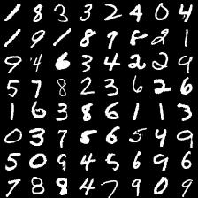

# Comparison of Generative Models in Tensorflow

The different generative models considered here are **Variational Autoencoders (VAEs)** and **Generative Adversarial Networks (GANs)**.

This experiment is accompanied by blog post at : [https://kvmanohar22.github.io/Generative-Models](https://kvmanohar22.github.io/Generative-Models)

## Usage

- Download the MNIST and CIFAR datasets

#### Train VAE on mnist by running:
```python

python main.py --train --model vae --dataset mnist
```
#### Train GAN on mnist by running:

```python

python main.py --train --model gan --dataset mnist
```

For the complete list of command line options, run:

```python
python main.py --help
```

The model generates images at a frequence specified by `generate_frq` which is by default 1.

## Results of training GAN on mnist

Sample images from mnist data is :

~[](images/target_mnist.jpg)


GIF showing images generated from GAN as a function of epochs is as follows:


For examples and explanation, have a look at the [blog post](https://kvmanohar22.github.io/Generative-Models).
